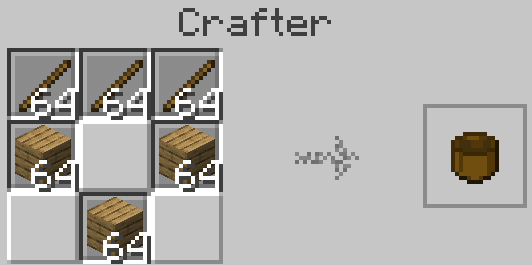
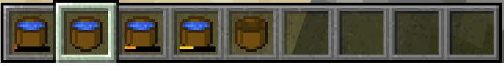

# HectorCastelli Bucket-less

Alternatives to the iron buckets.

These are meant to be used mainly on the early game, when Iron is still scarce, and are meant to remove the need to rush for iron, allowing you to enjoy the early game for longer.

## Features

- Adds a new item "Crude Bucket" that:
  - Can only hold water. Lava will destroy it and leave you with coal!
  - Cannot be used to make obsidian. Lava will boil the water inside it.
  - Leaks over time, so it's not a permanent solution

## Where to find it

This mod is available in [Modrinth: "Bucket-less"](https://modrinth.com/datapack/bucketless).

## Gallery

### Crude Bucket

#### Leaking

