# HectorCastelli Headless Tools

A vanilla-friendly Datapack that implements ways to carry lots of tools when you are traveling!

It allows you to prepare tool blades before hand, and carry them in bulk with you.

Once you are ready to use them, assemble without the need for a crafting table, and get to work!

## Features

- Adds a new item "Mounting Handle"
- Adds a new category of items "Detached \<Tool\>" that can be:
 - Stacked & Bundled
 - Enchanted
- Allows handles and detached tools to be combined for a full tool!

## Where to find it

This mod is available in [Modrinth: "Headless Tools"](https://modrinth.com/datapack/headlesstools).

## Gallery

### Handle

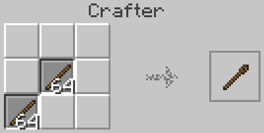

### Detached Tool Blades

#### Multiple materials

| Material | Axe | Pickaxe | Hoe | Shovel |
|---:|:---:|:---:|:---:|:---:|
| Copper | 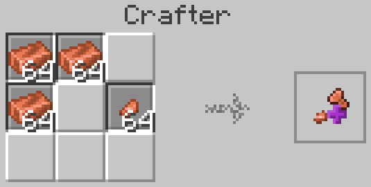 | 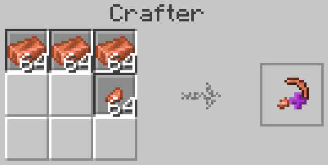 | 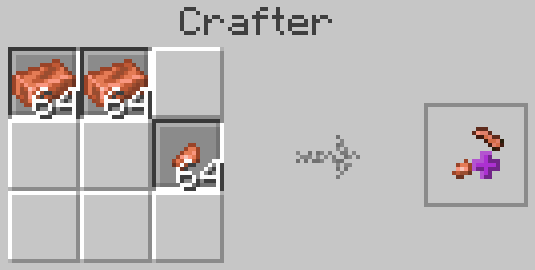 | 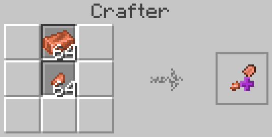 |
| Iron | 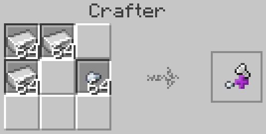 |  | 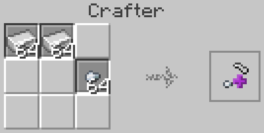 | 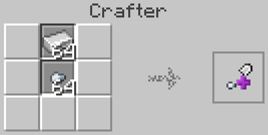 |
| Gold | 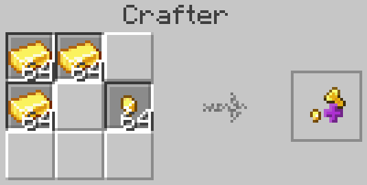 | 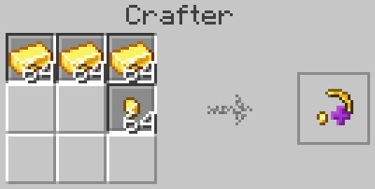 | 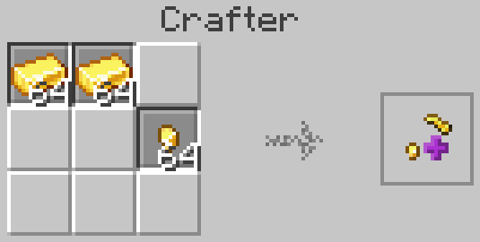 | 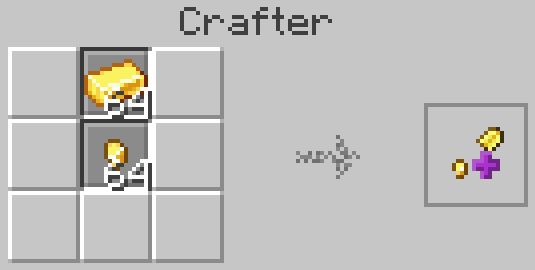 |
| Netherite | 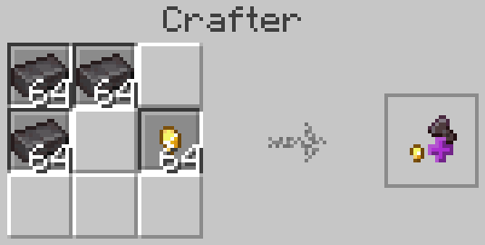 | 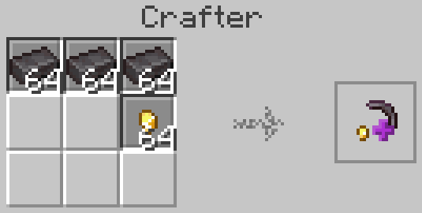 | 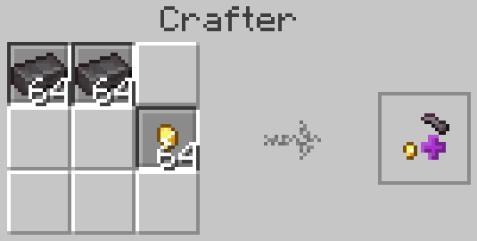 | 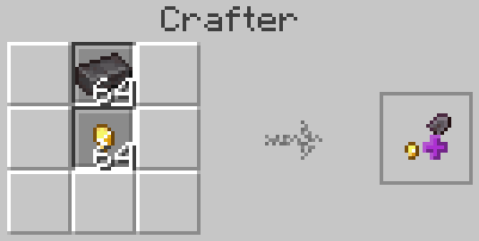 |

#### Enchanting

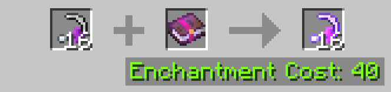

### Stacking

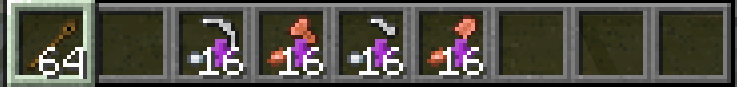

#### Bundles

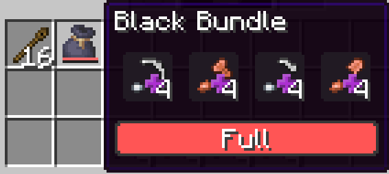